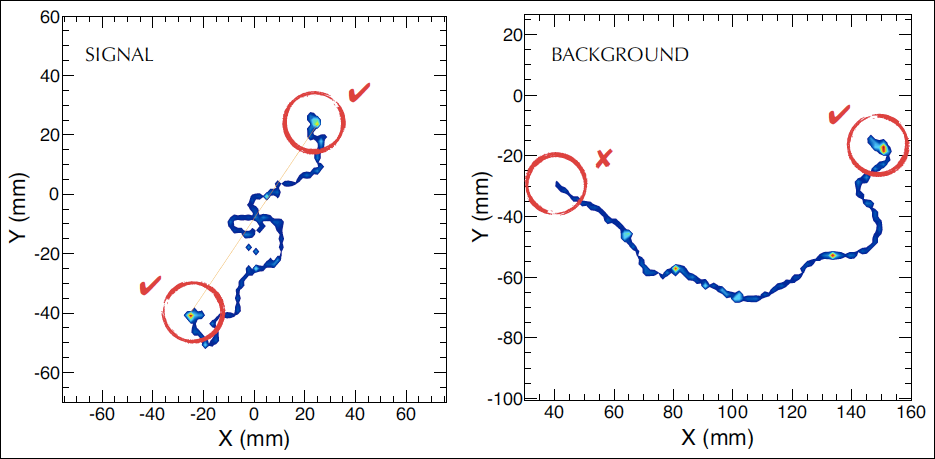
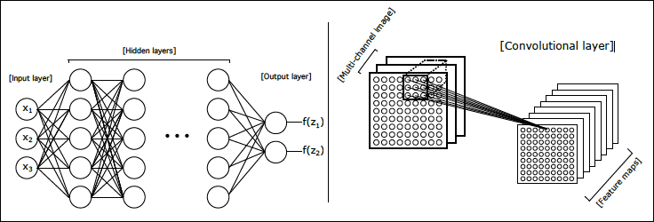

<script type="text/javascript"
    src="http://cdn.mathjax.org/mathjax/latest/MathJax.js?config=TeX-AMS-MML_HTMLorMML">
</script>

# Introduction

Here we describe a project addressing signal/background classification in the [NEXT](http://next.ific.uv.es/next) experiment using deep neural networks (DNNs). This study is a continuation of [a previous study](https://arxiv.org/abs/1609.06202) of background rejection in NEXT using DNNs.  Though some of the details described in this study will be re-iterated below, please see the previous study for more details on how the NEXT detector operates.

- [Software Requirements](#software-requirements)
- [Background](#background)
- [Data Formatting](#data-formatting)
- [Neural Network Definition](#neural-network-definition)
- [Additional References](#additional-references)

## Software Requirements
This study will require the use of Python (the [Anaconda](https://www.continuum.io) distribution is recommended) and several key Python packages:

- [Numpy](http://www.numpy.org/)
- [PyTables](http://www.pytables.org/)
- [Jupyter Notebooks](http://jupyter.org/)
- The [Keras](https://keras.io) deep learning library (with [Tensorflow](https://www.tensorflow.org))

## Background

One of the most important aspects of the NEXT experiment is its ability to reconstruct the ionization tracks produced when energetic electrons deposit their energy in the high pressure xenon gas present inside the NEXT detector.  Because many natural radioactive processes can produce energy depositions with an energy similar to that of neutrinoless double-beta decay (for xenon, this energy is $$ Q_{\beta\beta} \approx 2.4 $$ MeV and common backgrounds include gamma rays produced by nuclear decay of $$^{208}$$Tl and $$^{214}$$Bi.) and because neutrinoless double-beta decay is so rare, we will likely see many events in NEXT with energies that make them look like they could be neutrinoless double-beta decay.  This will occur despite the shielding provided by the many meters of rock in the Pyrenees mountains, the lead castle inside which the detector is placed, and the copper shielding inside the detector surrounding the active region!  These **background** events must be discarded ("rejected") while the real double-beta events - the **signal** events - are kept.  By just looking at the energy deposited by each event, we will be able to remove many events that do not have the energy of interest, but at some point this no longer works because all detectors have a finite energy resolution and we will have to choose a region of energies of potential interest.  Many background events will still fall into this region.

NEXT has further power to reject background because the ionization track of most background events (those due to gamma rays) will be produced by a single electron while the track of a neutrinoless double beta ($$0\nu\beta\beta$$) event is produced by two electrons.  Because of the way energetic electrons lose energy in gaseous detectors, these two types of ionization tracks will, most of the time, look distinctly different.  In particular, energetic electrons ionize xenon atoms at a lower density when they have higher energy, and the ionization density increases as the electron loses energy.  Energetic electrons are also subject to less **multiple scattering** (the phenomenon responsible for causing energetic electrons to undergo sudden sharp changes in direction while depositing their energy) at higher energies than at lower energies.  Thus a single-electron track will look smoother near the beginning with less energy deposited per unit distance, and more distorted near the end, with a "blob" of higher-density energy deposition at the end.  A track produced by two electrons emitted from a common vertex (such as in $$0\nu\beta \beta$$) will be smoother and less dense near the vertex and have two such "blobs" at the ends.


**Monte Carlo simulation** of a signal (left) and background (right) event.  The signal event consists of two electrons emitted from a common vertex with a total energy equal to $$Q_{\beta\beta}$$.  The background event is a single electron with energy $$Q_{\beta\beta}$$.  Figure from [*J. Mart&iacute;n-Albo et al.  Sensitivity of NEXT-100 to neutrinoless double beta decay.  \[JHEP 1605 159 (2016)\]*](https://arxiv.org/abs/1511.09246).
{: style="color:gray; font-size: 80%; text-align: left;"}

The electron track itself is observed in NEXT by a plane of silicon photomultipliers (SiPMs), which convert photons incident on their sensitive area into electrical current.  In the present phase of NEXT, the 10-kg-scale detector NEXT-NEW, the SiPM plane consists of 1792 SiPMs arranged with a 1 cm pitch.  In detecting an event, 2D (x,y) projections of the corresponding ionization track are formed by the light detected in the SiPMs in each z-interval ("slice") of the track.  That is, for each event, we are presented with a series of 2D SiPM "patterns" which must be used to make a decision on which type of event occurred - "signal" or "background".  

Rather than attempting to reconstruct the 3D track from these patterns and then examine the topology of the track to determine whether we have a signal or background event, we will attempt to skip the reconstruction step altogether.  *We intend to train a DNN to learn the difference between a signal and a background event based solely on the matrix of SiPM signals.*  The idea of one or two "blobs", or how we differentiate the two types of events visually, is no longer relevant.  The DNN works out in whatever way it can how to distinguish the two types of events.

## Data formatting

We will start with SiPM response data from each event arranged in a $$20\times 20\times N_s$$ matrix.  In this case the SiPM signals have already been integrated into $$N_s$$ time slices and the $$20\times 20$$ window in (x,y) over which the event occurs has been selected.  Note that the events are expected to be localized to approximately a cube of side 20 cm<sup>3</sup>.  Events containing less than some percentage (90%) of their total SiPM charge in SiPMs outside of this window have been eliminated.

## Neural network definition

This is the most interesting part of the study in which we determine which neural net performs best for the classification problem.  For this, several factors must be considered, including:

- **accuracy**: what percentage of the time the DNN correctly classifies an event.  The accuracy on test events (those not used in the training process) is the most important factor in evaluating the performance of the DNN.
- **network size**: the number of parameters in the network.  Smaller is better, but if going larger means more accuracy it is likely to be worth it.
- **network architecture**: the techniques employed in the construction of the network.  This will affect how long it takes to train the network, the tendency of the network to overtrain (memorize the training data rather than learn more general features that can be applied outside of the training set), and possibly how 

It is likely that since our data is formatted in a 3D matrix, we will want to use 2D or 3D convolutional layers, in which a layer of neurons shares the same weights and biases, and each neuron in the layer takes as input some subset of the neurons in the previous layer.  The neurons in such layers roughly serve to identify certain "features" or patterns in neighboring input neurons.


**Fully connected (left) vs. 2D convolutional (right) layers** in a neural network.  In a fully connected layer, each neuron from the previous layer is connected to every neuron as input.  In a 2D $$m\times n\,(\times\,k_i)$$ convolutional layer, each neuron takes as input an $$m\times n$$ subset of the previous layer of neurons arranged in $$k_i$$ input channels.  (A 3D convolutional layer would take a $$m\times n\times l\, (\times\, k_i)$$ subset.)  Part of figure from [*J. Renner et al.  Background rejection in NEXT using deep neural networks. \[JINST 12 T01004 (2017)\]*](https://arxiv.org/abs/1609.06202).
{: style="color:gray; font-size: 80%; text-align: left;"}

Keras/TensorFlow allows for the fast construction of neural networks using several different types of layers ([Dense (fully connected)](https://keras.io/layers/core/), [Conv2D, Conv3D](https://keras.io/layers/convolutional/)) with different [activation functions](https://keras.io/activations/) (sigmoid, relu, tanh), [loss functions](https://keras.io/losses/) and [training optimizers](https://keras.io/optimizers/), in combination with other deep learning techniques such as [dropout](https://keras.io/layers/core/#dropout) and [pooling](https://keras.io/layers/pooling/).

The idea here is to find the optimal neural net that gives the best accuracy for the smallest network size and learns quickly and with fewest training events.  Again, though all such factors should be considered, the most important factor is the overall accuracy.  Even better, a neural network that allows for some understanding of how the classification decision is being made would be ideal.

The construction of the DNN can be implemented directly into the NEXT classification Jupyter notebook by making a corresponding Python method definition.

<a style="text-decoration: none; font-family: verdana, arial;" href="https://github.com/jerenner/next-dnn-topology">
<br>**NEXT Classification Jupyter Notebook**</a>
{: style="color:black; font-size: 130%; text-align: center;"}

For example:

```python
inputs = Input(shape=(xdim, ydim, zdim, 1))
cinputs = Convolution3D(256, 5, 5, 5, border_mode='same', subsample=(4, 4, 4), activation='relu',init='lecun_uniform')(inputs)
cinputs = MaxPooling3D(pool_size=(3, 3, 3), strides=(2, 2, 2), border_mode='same', dim_ordering='default')(cinputs)
f1 = Flatten()(cinputs)
f1 = Dense(output_dim=128, activation='relu', init='lecun_uniform')(f1)
f1 = Dropout(.3)(f1)
inc_output = Dense(output_dim=1, activation='sigmoid',init='normal')(f1)
model = Model(inputs, inc_output)
```

## Additional References
Some additional references:

- [Neural Networks and Deep Learning](http://neuralnetworksanddeeplearning.com/): an online book which covers in detail the main concepts used in this study