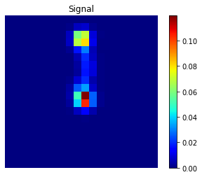
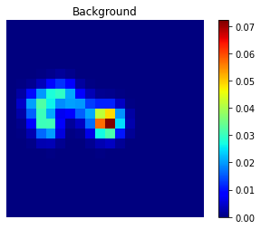

---
title:
tlink: "https://github.com/jerenner/next-dnn-topology"
layout: default
---

<script type="text/javascript" async
  src="https://cdn.mathjax.org/mathjax/latest/MathJax.js?config=TeX-MML-AM_CHTML">
</script>

Here we describe a project addressing signal/background classification in the [NEXT](http://next.ific.uv.es/next) (Neutrino Experiment with a Xenon TPC) experiment using deep neural networks (DNNs).

- [Software Requirements](#software-requirements)
- [Background](#background)
- [Data Format](#data-format)
- [Jupyter Notebook](#jupyter-notebook)
- [Additional References](#additional-references)

## Software Requirements
This study will require the use of Python (the [Anaconda](https://www.continuum.io) distribution is recommended) and several key Python packages:

- [Numpy](http://www.numpy.org/)
- [PyTables](http://www.pytables.org/)
- [Jupyter Notebooks](http://jupyter.org/)
- The [PyTorch](https://pytorch.org/) deep learning library

## Background

NEXT will search for neutrinoless double-beta decay ($$0\nu\beta\beta$$) using a high-pressure xenon gas time projection chamber (TPC). One of the most important aspects of the NEXT experiment is its ability to reconstruct the ionization tracks produced when energetic electrons deposit their energy in the xenon gas.  Because many natural radioactive processes can produce energy depositions with an energy similar to that of $$0\nu\beta\beta$$ (for xenon, this energy is $$ Q_{\beta\beta} \approx 2.4 $$ MeV and common backgrounds include gamma rays produced by nuclear decay of $$^{208}$$Tl and $$^{214}$$Bi) and because this decay is so rare, many events are likely to be observed in the energy region of interest. This will occur even despite the shielding provided by the many meters of rock in the Pyrenees mountains where NEXT is stationed, the lead castle inside which the detector is placed, and the copper shielding inside the detector surrounding the active region!  These **background** events must be discarded ("rejected") while the real double-beta events - the **signal** events - are kept.

NEXT has further power to reject background because the ionization track of most background events (those due to gamma rays) will be produced by a single electron while the track of a $$0\nu\beta\beta$$ event will be produced by two electrons.  Because of the way energetic electrons lose energy in gaseous detectors, these two types of ionization tracks will, most of the time, look distinctly different.  In particular, energetic electrons ionize xenon atoms at a lower density when they have higher energy, and this ionization density increases as the electron loses energy.  Energetic electrons are also subject to less **multiple scattering** (the phenomenon responsible for causing these electrons to undergo sudden sharp changes in direction while depositing their energy) at higher energies than at lower energies.  Thus a single-electron track will look smoother near the beginning with less energy deposited per unit distance, and more distorted near the end, with a "blob" of higher-density energy deposition at the end.  A track produced by two electrons emitted from a common vertex (such as in $$0\nu\beta \beta$$) will be smoother and less dense near the vertex and have two such "blobs" at the ends.


**Monte Carlo simulation** of a signal (left) and background (right) event.  The signal event consists of two electrons emitted from a common vertex with a total energy equal to $$Q_{\beta\beta}$$.  The background event is a single electron with energy $$Q_{\beta\beta}$$.  Figure from [*J. Mart&iacute;n-Albo et al.  Sensitivity of NEXT-100 to neutrinoless double beta decay.  \[JHEP 1605 159 (2016)\]*](https://arxiv.org/abs/1511.09246).
{: style="color:gray; font-size: 80%; text-align: left;"}

The electron track itself is observed in NEXT by a plane of silicon photomultipliers (SiPMs), which convert photons incident on their sensitive area into electrical current.  In detecting an event, 2D (x,y) projections of the corresponding ionization track are formed by the light detected in the SiPMs in each z-interval ("slice") of the track.  That is, for each event, we are presented with a series of 2D SiPM "patterns" which can then be used to reconstruct one or more "hits" (energy depositions) per pattern.  This collection of hits must be used to make a decision on which type of event occurred - "signal" or "background".  

To do this, we will divide up the volume over which the event occurred into a 3D grid of smaller cubical volume elements called "voxels."  Each voxel will be filled with the energies of the hits that are reconstructed to a location $$(x,y,z)$$ inside of it.  In this study, we will attempt to use a set of simulated (Monte Carlo) events saved as sets of voxelized hits to train a deep neural network to recognize patterns of voxels that correspond to "signal" events and "background" events.

## Data format

We will begin with a collection of voxels from each event arranged in a $$20\times 20\times 60$$ matrix.  These events are expected to be localized to approximately a cube of side 30 cm<sup>3</sup>.  Events containing energy depositions outside of this window will not be included.

{: .center}
<p align="center">


</p>
**Examples of signal and background events** projected onto the z-axis. Note that these events were selected because they specifically exhibit the expected "1-blob" (background), "2-blob" (signal) geometries in this projection.
{: style="color:gray; font-size: 80%; text-align: left;"}

## Neural network definition

One goal of this study is to design a neural net that best performs the classification. It is likely that since our data is formatted in a 3D matrix, we will want to use 2D or 3D convolutional layers, in which a layer of neurons shares the same weights and biases, and each neuron in the layer takes as input some subset of the neurons in the previous layer.  The neurons in such layers roughly serve to identify certain "features" or patterns in neighboring input neurons.


**Fully connected (left) vs. 2D convolutional (right) layers** in a neural network.  In a fully connected layer, each neuron from the previous layer is connected to every neuron as input.  In a 2D $$m\times n\,(\times\,k_i)$$ convolutional layer, each neuron takes as input an $$m\times n$$ subset of the previous layer of neurons arranged in $$k_i$$ input channels.  (A 3D convolutional layer would take a $$m\times n\times l\, (\times\, k_i)$$ subset.)  Part of figure from [*Background rejection in NEXT using deep neural networks. \[JINST 12 T01004 (2017)\]*](https://arxiv.org/abs/1609.06202).
{: style="color:gray; font-size: 80%; text-align: left;"}

The idea here is to find the optimal neural net that gives the best accuracy with a reasonable network size. One way of measuring the performance of the network is by plotting the *signal efficiency* against the *background rejection* for varying neural network classification thresholds.

- The *signal efficiency* is: <br>(total number of correctly classified signal events) / (total number of signal events)
- The *background rejection* is: <br>(total number of correctly classified background events) / (total number of background events)

That is, we construct a neural network that computes the probability that a given event is signal, and we define a signal event as one for which the network computes a probability greater than some threshold $$t \in [0,1]$$. Varying this threshold traces out an [ROC curve](https://en.wikipedia.org/wiki/Receiver_operating_characteristic) in signal efficiency vs. background rejection.

## Jupyter notebook

The study is outlined in the [NEXT Classification Jupyter Notebook](https://github.com/jerenner/next-dnn-topology/blob/master/NEXT_classification.ipynb). The initial goal is to design an optimal network in PyTorch to perform the classification.

An example network is given:

```python
# define a fully-connected network with 32 hidden neurons and 1 readout neuron
class FCNet(nn.Module):

    def __init__(self):
        super(FCNet, self).__init__()
        self.fc1 = nn.Linear(xdim*ydim*zdim, 32)
        self.fc2 = nn.Linear(32, 1)

    def forward(self, x):
        x = torch.sigmoid(self.fc1(x.reshape(-1,xdim*ydim*zdim)))
        x = self.fc2(x)
        return x
```

This basic network is unlikely to get very far, and a much better one will need to be implemented.

## Additional References
Some additional references:

- [Neural Networks and Deep Learning](http://neuralnetworksanddeeplearning.com/): an online book which covers in detail the main concepts used in this study
